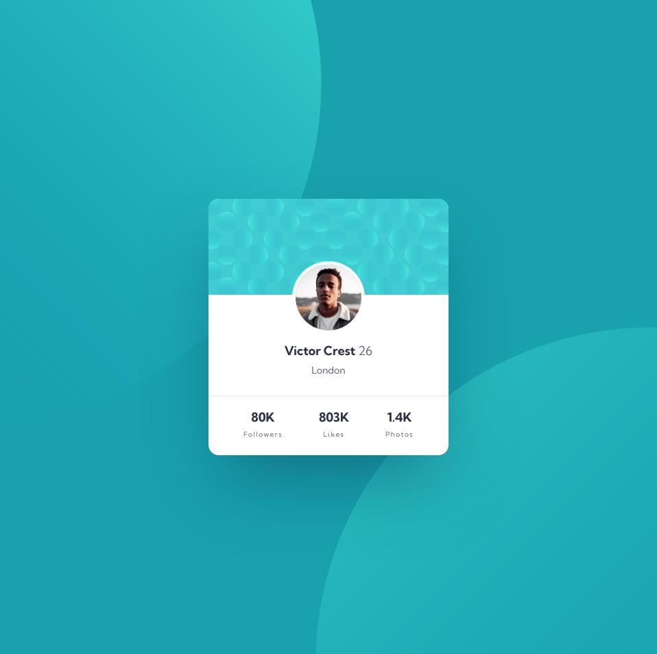

# Frontend Mentor - Profile card component solution

This is a solution to the [Profile card component challenge on Frontend Mentor](https://www.frontendmentor.io/challenges/profile-card-component-cfArpWshJ). Frontend Mentor challenges help you improve your coding skills by building realistic projects. 

## Table of contents

- [Overview](#overview)
  - [The challenge](#the-challenge)
  - [Screenshot](#screenshot)
  - [Links](#links)
- [My process](#my-process)
  - [Built with](#built-with)
  - [What I learned](#what-i-learned)
- [Author](#author)

## Overview

### The challenge

- Build out the project to the designs provided

### Screenshot

### Links

- Solution URL: [https://www.frontendmentor.io/solutions/profile-card-component-RqdCGDFgm](https://www.frontendmentor.io/solutions/profile-card-component-RqdCGDFgm)
- Live Site URL: [https://hardcore-jennings-0dcafb.netlify.app/](https://hardcore-jennings-0dcafb.netlify.app/)

## My process

### Built with

- HTML
- CSS custom properties
- Flexbox

### What I learned

Using multiple background images on same element, and using background-position to position the images in bacground using keywords and offsets.

## Author

- Frontend Mentor - [@yourusername](https://www.frontendmentor.io/profile/ACdev27/solutions)
